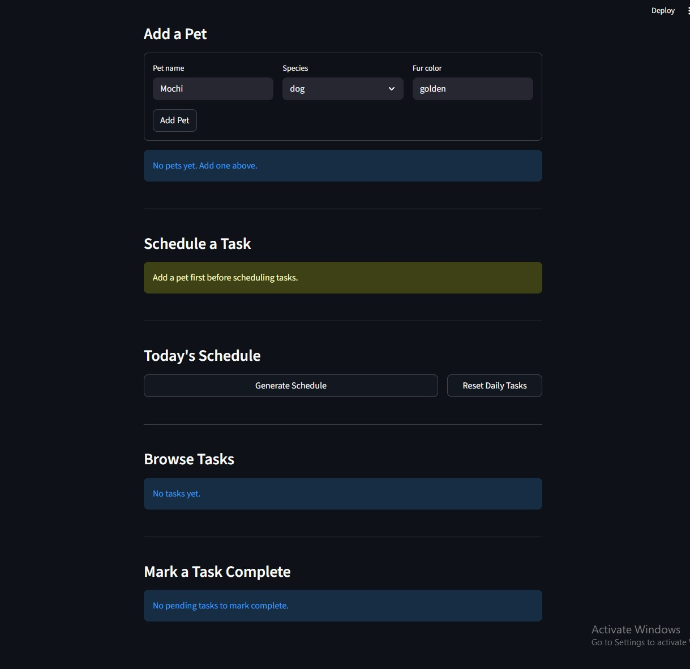

# PawPal+ (Module 2 Project)

You are building **PawPal+**, a Streamlit app that helps a pet owner plan care tasks for their pet.

## Scenario

A busy pet owner needs help staying consistent with pet care. They want an assistant that can:

- Track pet care tasks (walks, feeding, meds, enrichment, grooming, etc.)
- Consider constraints (time available, priority, owner preferences)
- Produce a daily plan and explain why it chose that plan

Your job is to design the system first (UML), then implement the logic in Python, then connect it to the Streamlit UI.

## What you will build

Your final app should:

- Let a user enter basic owner + pet info
- Let a user add/edit tasks (duration + priority at minimum)
- Generate a daily schedule/plan based on constraints and priorities
- Display the plan clearly (and ideally explain the reasoning)
- Include tests for the most important scheduling behaviors

## Smarter Scheduling

Phase 2 extended the `Scheduler` class with four algorithmic features:

### 1. Sort by time
`Scheduler.sort_by_time(pairs)` accepts any list of `(pet, task)` pairs and
returns them ordered by `scheduled_time` (earliest first).  Tasks with no
clock time receive the sentinel `"99:99"` so they fall to the end without
raising a `TypeError`.  The key is a single lambda on the `"HH:MM"` string —
zero-padded 24-hour strings sort correctly as plain text.

### 2. Filter by pet or status
`Scheduler.filter_tasks(pet_name, status)` narrows the full task list with two
optional filters that can be combined:

| Call | Returns |
|---|---|
| `filter_tasks(pet_name="Mochi")` | All of Mochi's tasks (any status) |
| `filter_tasks(status="pending")` | Every unfinished task across all pets |
| `filter_tasks(pet_name="Luna", status="completed")` | Luna's finished tasks only |

### 3. Recurring task automation
When `complete_task()` marks a `"daily"` or `"weekly"` task done, it
automatically spawns a new Task copy for the next occurrence using
`datetime.timedelta`:

```
daily  → due_date = today + timedelta(days=1)
weekly → due_date = today + timedelta(weeks=1)
once   → no new instance created
```

The completed original is kept as history.  New instances stay invisible in
`get_all_pending()` until their `due_date` arrives, so tomorrow's tasks never
crowd today's schedule.

### 4. Conflict detection
`Scheduler.detect_conflicts()` scans today's pending tasks for overlapping
time windows using the standard interval-overlap test
(`start_A < end_B and start_B < end_A`).  It uses `itertools.combinations` to
compare every unique task pair without index arithmetic.  Two conflict types
are reported:

- **SAME-PET** — a pet cannot be walked and bathed simultaneously
- **CROSS-PET** — a single owner cannot attend two animals at once

The method always returns a list of warning strings and never raises an
exception, so the caller can print warnings without risking a crash.

---

## Testing PawPal+

### Run the test suite

```bash
python -m pytest tests/test_pawpal.py -v
```

### What the tests cover

| Area | # Tests | Description |
|---|---|---|
| Task basics | 6 | `complete()`, `reset()`, `describe()` formatting (time, due date, status label) |
| Pet basics | 6 | Adding/removing tasks, `get_pending_tasks`, happiness and fullness clamping at 100 |
| Sorting | 5 | Chronological order, unscheduled tasks sort last, tie-breaking by priority then duration, future due-date exclusion |
| Recurrence | 8 | Daily/weekly spawning with correct next `due_date`, `once` tasks never spawn, `reset_tasks` idempotence, walk/feed stat effects |
| Conflict detection | 5 | `SAME-PET` and `CROSS-PET` warnings, sequential tasks don't conflict, unscheduled tasks skipped, exact same start time |
| Edge cases | 6 | Empty pet roster, unknown pet or task title, unknown pet in filter |

**Total: 36 tests**

### Confidence level

★★★★★ (5/5)

All 36 tests pass. The suite covers every public method on `Scheduler`, both happy paths and the edge cases most likely to hide bugs (empty inputs, boundary dates, duplicate start times, clamping). The one area not unit-tested is the Streamlit UI layer in `app.py` — that would require browser-level integration tests.

---

## Demo



---

## Getting started

### Setup

```bash
python -m venv .venv
source .venv/bin/activate  # Windows: .venv\Scripts\activate
pip install -r requirements.txt
```

### Suggested workflow

1. Read the scenario carefully and identify requirements and edge cases.
2. Draft a UML diagram (classes, attributes, methods, relationships).
3. Convert UML into Python class stubs (no logic yet).
4. Implement scheduling logic in small increments.
5. Add tests to verify key behaviors.
6. Connect your logic to the Streamlit UI in `app.py`.
7. Refine UML so it matches what you actually built.
